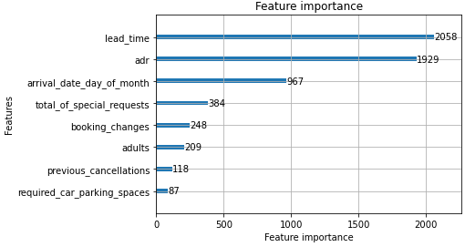
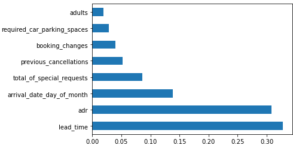
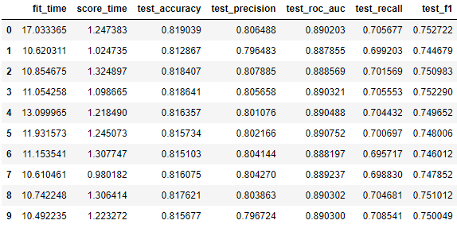

# Hotel Booking Demand Analysis & Cancellation
For this project, I used Hotel Booking Demand Datasets from Kaggle to creat meaningful analysis report of hotel business. I also created classification model using simple regresion & Random Forest to predict hotel booking cancellation.

Question:
What are the features correlated to booking cancellation and can machine learning algorithm predict booking cancellation of customer based on features in the datasets?

Here are the outcomes of the project
  * Correlation tests reveals that *1) lead time, 2) total of special request, 3) required car parking spaces ,4) booking changes and 5) previous cancellations* have some correlation to booking cancellations
    - *1) lead time: Number of days that elapsed between the entering date of the booking into the PMS and the arrival date*    
    - *2) total of special request: Number of special requests made by the customer (e.g. twin bed or high floor)*
    - *3) required car parking spaces: Number of car parking spaces required by the customer*
    - *4) booking changes: Number of changes/amendments made to the booking from the moment the booking was entered on the PMS*
    - *5) previous cancellations: Number of previous bookings that were cancelled by the customer prior to the current booking*
  * Exploratory Data Analysis shows that there is a higher chance of booking cancellations when,
      - customer is group traveler
      - deposit is non-refund
      - large number of days between booking date and the check-in date
      - customer previously cancelled at least one time
  * Also, if there is special requests and request for car parking space, customer is less likely to cancel the booking
  * Trained a classification model to predict which bookings are likely to cancel
      - Created/Tested Logistic Regression, Decision Tree, Naive Bayes, Light BGM, and Random Forest
      - Both Light BGM & Random Forest suggest lead time & adr are the most important features which should be considered to predict booking cancellation
      - The best model of this study is Random Forest with mean accuracy at 81.6% from cross validation

**Important features - Light GMB**

**Important features - Random Forest**

**Random Forest Cross Validation Report**

More info:[https://github.com/kilee722/Hotel_Booking_Cancellation/blob/main/hotel_cancel_classification.ipyn](https://github.com/kilee722/Hotel_Booking_Cancellation/blob/main/hotel_cancel_classification.ipynb)

[Hotel Booking Demand Datasets: Kaggle](https://www.kaggle.com/jessemostipak/hotel-booking-demand)

## Technologies
* Python
* numpy
* pandas
* seaborn
* matplotlib
* sklearn
